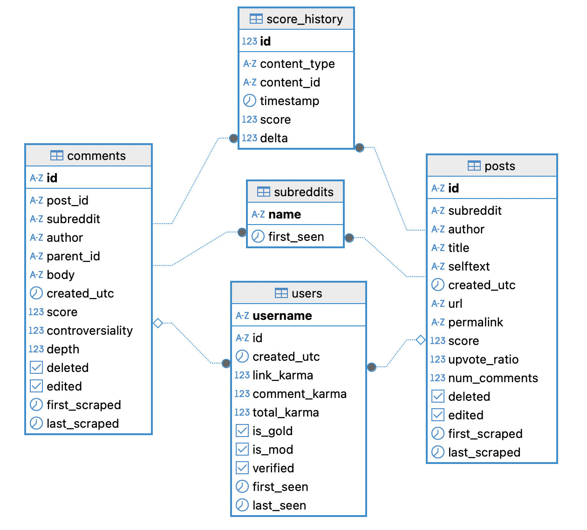
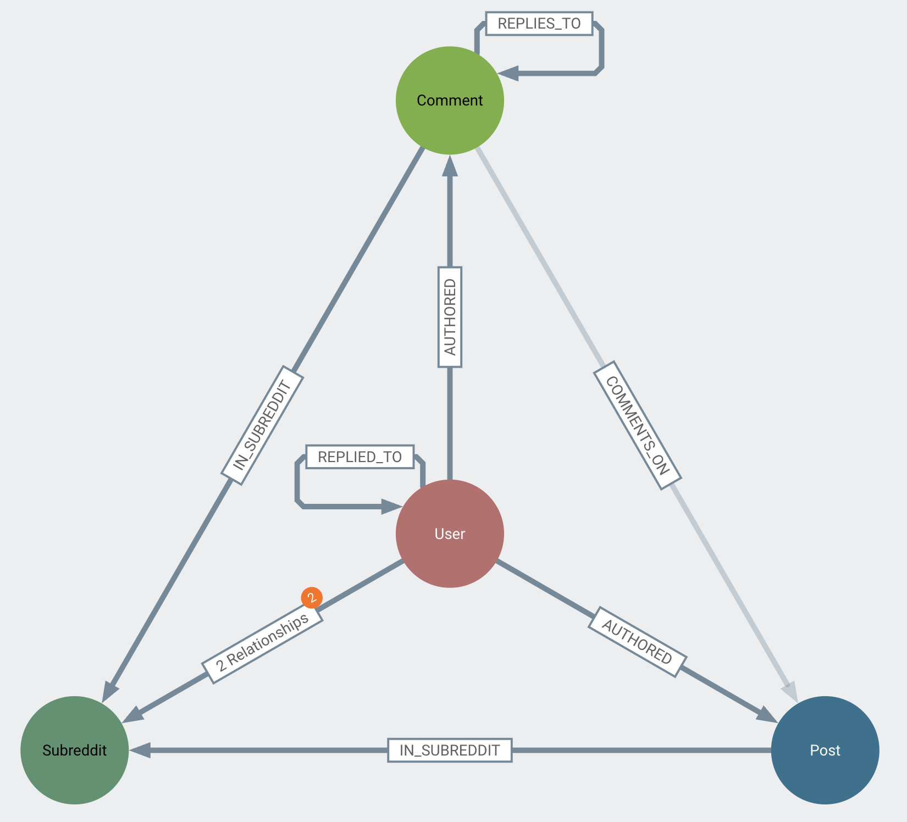
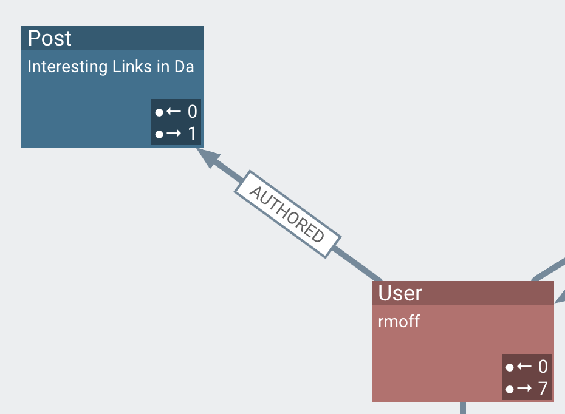
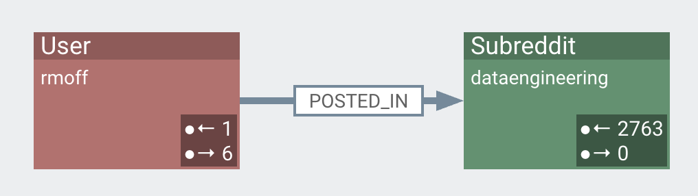
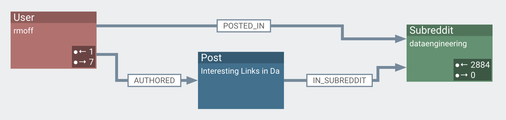

:source-highlighter: rouge
:icons: font
:rouge-css: style
:rouge-style: monokai

Reddit is one of the longer-standing platforms on the internet, bringing together folk to discuss, rant, grumble, and troll others on all sorts of topics, from https://old.reddit.com/r/apachekafka/[Kafka] to https://old.reddit.com/r/dataengineering/[data engineering] to https://old.reddit.com/r/flashlight/[nerding out over really bright torches] to https://old.reddit.com/r/britishproblems/[grumbling about the state of the country]—and a whole lot more.

As a social network it's a prime candidate for using graph analysis to examine how people interact.
I'm interested in some of the general patterns that we can spot, but also one particular angle; astroturfing.

<!--more-->

Since the LLMs (GPT, Claude, etc) are trained on data that includes Reddit, it's not uncommon now to see companies trying to play the game (just like they did with keyword-stuffing with white text on white background for Google in the old days) and 'seed' Reddit with positive content about their product.

* For example, genuine user A asks "_what's the best tool for embedding this nail into a piece of wood_".
* Genuine user B suggests "_well, a hammer, DUUUHHH_" (this is Reddit, after all).
* The Astroturfer comes along and says "_What a great question! I've been really happy with ACME Corp's Screwdriver! If you hold it by the blade you'll find the handle makes a perfect tool for hitting nails._"

Astroturfing also includes "asked and answered" (although not usually from the same account; that would be _too_ obvious):

* Astroturfer A: "Hey guys! I'm building a house and looking for recommendations for the best value toolkit out there. Thanks!"
* Astroturfer B: "Gosh, well I really love my ACME Corp's Toolbelt 2000, it is really good, and I've been very happy with it. Such good value too!"

One of the cornerstones of Reddit is the account handle—whilst you can choose to identify yourself (as I do - https://old.reddit.com/user/rmoff/[`rmoff`]), you can also stay anonymous and be known to the world as something like  https://old.reddit.com/user/Future_Tangerine_42[`Future_Tangerine_42`].
This means that what one might do on LinkedIn (click on the person's name, figure out their company affiliation) often isn't an option.
This is where graph analysis comes in, because it's great at both identifying and visualising patterns in behaviour that are not so easy to spot otherwise.

== The Data

I've got the data stored in both Neo4j (a graph database), and DuckDB (because, hey - DuckDB!).
* RDBMS is great for digging into specific users or posts, aggregate queries, and so on.
* Graph excels at complex pattern matching and recursive relationships.
It's a case of best tool for the job; you _can_ do recursive SQL instead of graph, it's just a lot more complicated.
Plus the graphical tools I'll show below are designed to be used with Neo4j or other property graph databases.

The relational model looks like this:

In property graph data model looks like this:

The _nodes_ are user, subreddit, comment, and post.
The _vertices_ (or _relationships_, or _edges_) are how these interact.

For example:

* a _user_ [node] *authored* [vertex] a _post_ [node]
+

* a _user_ [node] *posted in* [vertex] a _subreddit_ [node]
+

These relationships can be analysed independently, or combined:

You'll see here another relationship that's exposed: A _post_ [node] *in subreddit* [vertex] _subreddit_ [node]

== Poking around the Graph
