= Blog Writing for Developers
Robin Moffatt
:backend: revealjs
:revealjs_theme: league
:revealjs_transitionSpeed: fast
:revealjsdir: https://cdn.jsdelivr.net/npm/reveal.js@5

== `whoami`

- Robin Moffatt
- DevRel team @ Confluent
- Blogging since 2009, over 1.5 million page views
// 460k GA
// 580k Wordpress
// 527k confluent.io

[%notitle]
=== Wordpress in 2009

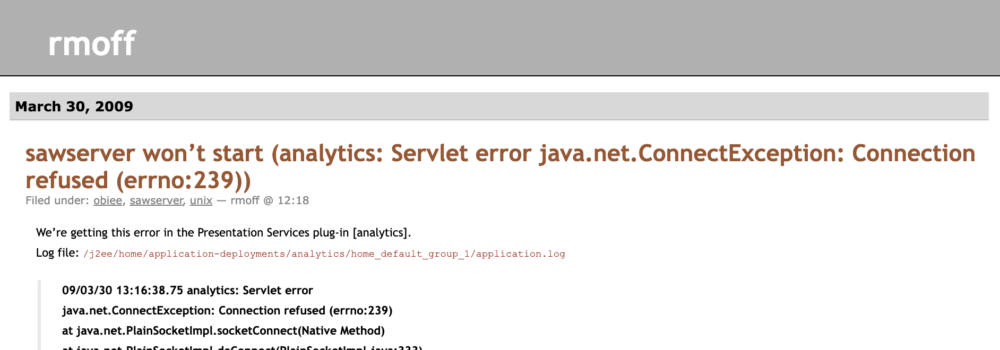

[%notitle]
=== Rittman Mead

image::images/2025-10-09T10-47-32-136Z.png[]

[%notitle]
=== Confluent

image::images/2025-10-09T10-46-31-574Z.png[]

=== rmoff.net

image::images/2025-10-09T10-45-17-982Z.png[]

// [%notitle]
// === Kafka Listeners post

// image::images/2025-10-09T10-55-40-086Z.png[]

[background-color="darkred"]
== IMHO

== What we're going to cover

* *Why*?
// blog?
* *What*?
// to blog _about_?
* *How*?
// to blog?
* _Other things that don't fit into action verbs!_
** Platforms and Tools
** Reviews
** AI

== Why

blog?

=== Because you were told to `¯\\_(ツ)_/¯`

=== Share

* If it was useful for me, it might be useful for someone else
* Sharing is caring
// Similar ethos to open source. We all benefit from shared knowledge and understanding in the field.

=== Learn

* If you can't explain something, do you _really_ understand it?

image::images/2025-10-10T06-29-25-548Z.png[]

=== Benefit

* Your product
// more people know about it, can find help with it
* Your employer
// visibility & credibility in the community
* The community
// fostering relationships
* You!
// potential employers may find you through your blog, or your blog might give you that 'edge' in a crowded market

== What

to blog _about_?

=== The Good

* If _I_ found it interesting, perhaps someone else will too.

// Small error messages
// Complete reimplementation of a platform
// New tools, techniques
// I have an opinion that I want to share or rant into the void

=== !
==== Common Problems

// Common problems that people encounter (go and mine Stack Overflow, Twitter, Slack for recurring questions)

_Maybe it's a docs gap…maybe it's a blogging opportunity :)_

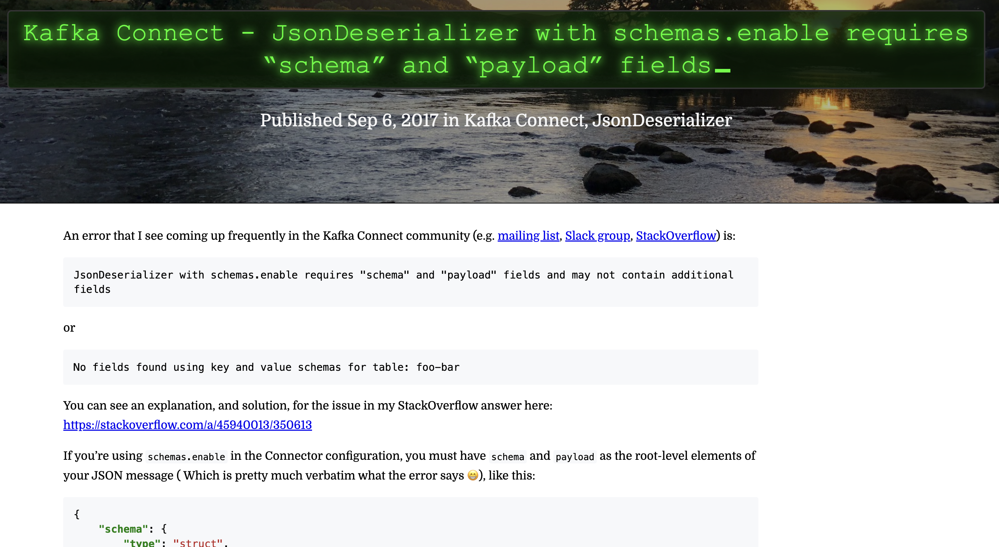

=== !
==== New tool

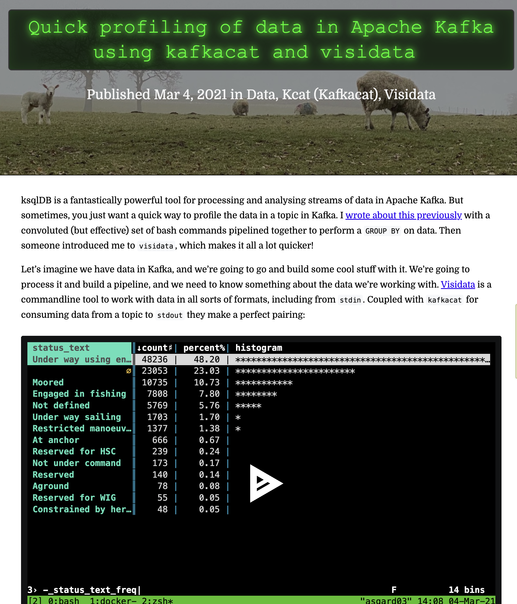

=== !
==== New technique

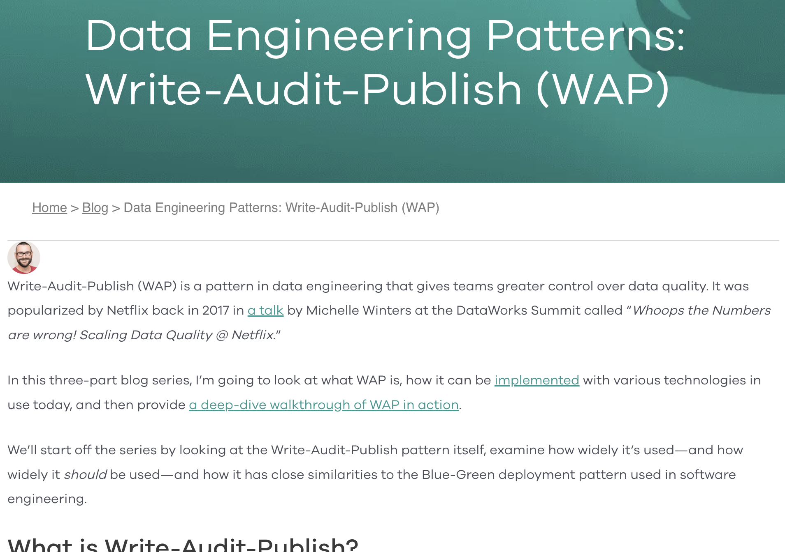

=== !
==== Handy tricks

image::images/2025-10-09T15-32-28-903Z.png[]

=== !
==== Meta-posting

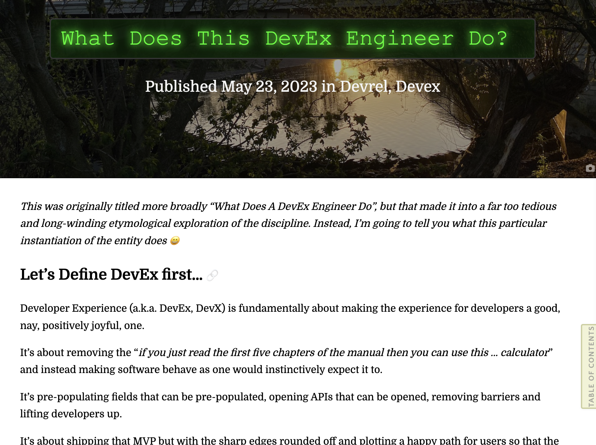

=== !
==== Navel-gazing

=== !
==== Patterns from https://writethat.blog/

* Bug Hunt
* We Rewrote It in X
* How We Built It
* Lessons Learned
* Thoughts on Trends
* Non-markety Product Perspectives
* Benchmarks and Test Results

=== So if that was the good…what about…
=== The Bad

- Low‑quality, SEO‑driven content
- Marketing copy
- Listicles

NOTE: These are 'bad' if you're writing _for developers_.

image::images/shrug.gif[Robert Downey Jr Shrug GIF]

=== The downright ugly

* Rage-baiting/engagement-hacking
* AI slop

NOTE: No caveat here.
Just don't do it.

image::images/no.gif[The Office no GIF]

// 16 minutes to here

== How

to blog?

=== !

* Structure
* Dimensions
* Process

=== Structure

. Tell them what you’re going to tell them
. Tell them
. Tell them what you told them

_See also: Hero’s Tale, Inverted Pyramid._

// Problem–Agitate–Solve (PAS) - State the problem → Intensify the pain → Offer the solution.
//  ▪	Great for copywriting, landing-page style posts, and intros that hook quickly.
// Before–After–Bridge (BAB) - Current state → Desired future → How to get there.
//  ▪	Good for transformation-focused posts and pitches.	•
// Inverted Pyramid (journalistic) - Most important info first → Supporting details → Background/context.
//  ▪	Optimised for readers who bounce quickly; good for news, updates, and announcements.

=== How much to cover

* Sometimes less is more
+
> I'm sorry I wrote you such a long letter; I didn't have time to write a short one.

// write what you want to
// don't make your reader wade through unnecessary content
// What kind of article is it? If it's a tech tip, for example, get to the point (c.f. recipes/grandma's life story). If it's a "thought piece" you have the luxury of more space
// just enough vs everything
// hyperlinks exist for a reason

=== The Perfect Happy Path

image::images/blog_content1.excalidraw.webp[]

=== Reality

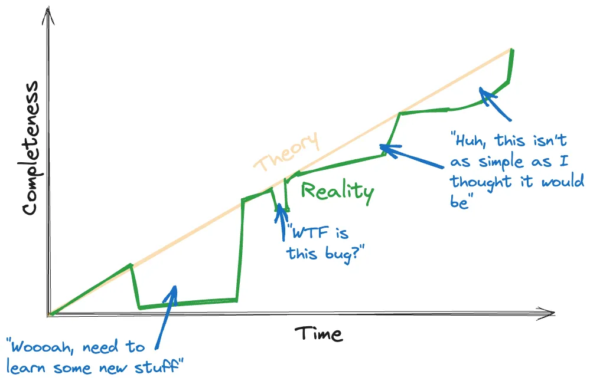

=== Latent Value

image::images/blog_content4.excalidraw.webp[]

=== Key Dimensions of Writing

// // Each writer will have their own approach to writing, and it will vary based on the audience and purpose too. A report for publication in an academic journey will have a different structure to a shitpost on Twitter. A blog aimed at developers will read very differently from the documentation from the depths of a product manual. Each medium and audience is valid; the knack is making sure that your writing lines up with it.

// * Clarity
// // Whatever you write, for whomever you write it, **it has to be clear**. Writing clearly means everything from sentence construction and paragraph breaks through to the structure of your article. It can be surprisingly hard to do but is crucial if you want to write material that people will _want_ to read.

// * Personality ("_Voice_")
// // What do you like reading in a blog post? what pisses you off about blog posts you've read?
// // Who are you writing for → You / PMM / Everyone
// * Uniformity

=== !
==== Voice / Personality

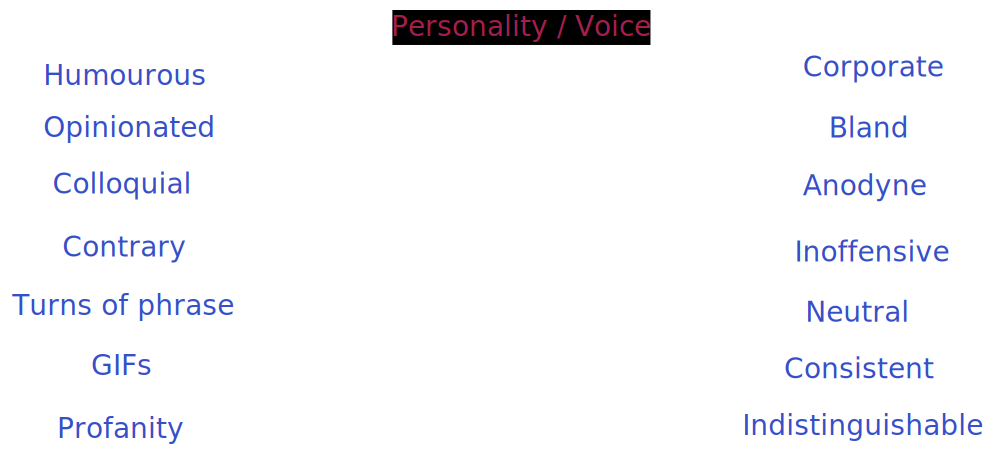

// How you decide where to pitch your voice on this scale will come down to your preference, audience, and general area and discipline. If you spend much time on Twitter you’ll notice that InfoSec Twitter is different from DevOps Twitter, which is different again from DataEng Twitter. Each has its own cliques and customs, and also a varying range to which an author’s voice shines through in published writing.

// You’ll generally find that generally writing mediums such as a project report to stakeholders or product documentation requires a neutral voice. That’s not to say _boring_, but it is to say that a certain uniformity is required. In the case of a project report, the message mustn’t be obscured by colloquialisms and the such. And can you imagine the cognitive dissonance if a set of documentation were written by multiple writers each looking to stamp their personality on the pages?

// When we get to things like blogs and other types of writing we _deliberately_ want to include some personality. How much is up to you to calibrate with your audience and yourself. There is a “Goldilocks” zone here—enough personality and genuine voice coming through to convince the reader that they are reading something that was written by someone who is actually interested and informed on the matter, but not so much that it gets in the way of the content.

=== !
==== Uniformity

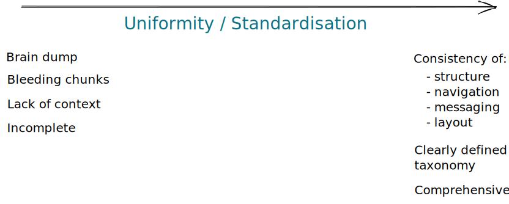

// Using the example of blogs, you’ll find that blogs for a company or project are going to have a strong focus on the consistency of messaging and structure. There’ll be an introduction, there’ll be context; it’ll be comprehensive.

// Compare that to a personal blog that may sometimes be not much more than the gutterings of a developer wanting to log an error message and solution for future Googlers. They _might_ flesh it out into a longer article, but that’s not necessary for it still to have value.

// [%notitle]
// === How you write depends on where you're writing and for whom

// image::images/dims01.excalidraw.png[]

// [%notitle]
// === There can be a range within each of these

// // Things aren’t always so simple, and for some platforms in particular there’s quite a range:

// image::images/dims02.excalidraw.png[]

[%notitle]
=== Regardless, you must maintain clarity

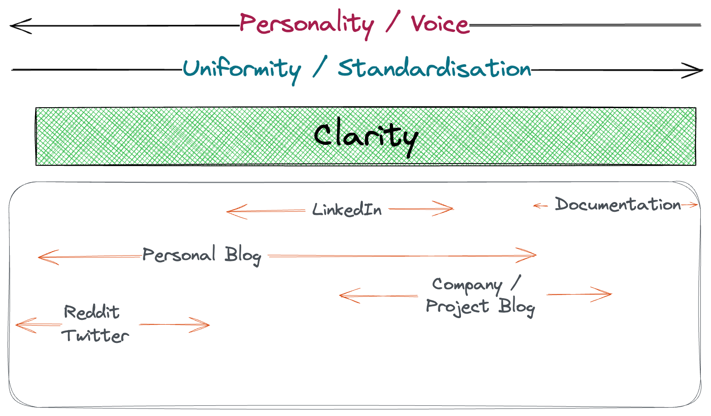

=== Process

=== Mind Maps

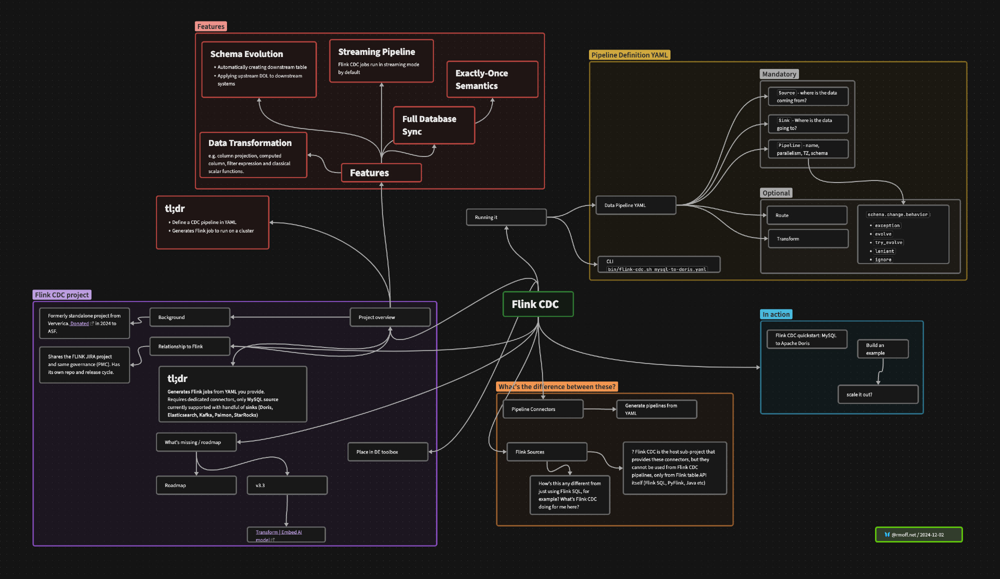

=== JFDI

image::images/08.png[]
// - Just start writing: get thoughts down and iterate

[background-image="owl_sketch.png", background-size="contain", background-transition="none"]
=== !

[background-image="owl_full.png", background-size="contain", background-transition="none"]
=== !

// 27 minutes to here

== Platforms & Tools

(See also https://github.com/scynthiadunlop/WritingForDevelopersBook/blob/main/links/README.md#where-to-post-your-posts[this list])

=== Self-hosted

_Blog-as-Code_

* Static site generator e.g. https://rmoff.net/categories/hugo/[Hugo]
* Free hosting e.g. GitHub Pages

https://github.com/rmoff/rmoff-blog/

=== Hosted

* Medium
* dev.to
* Substack

== Tools

* Obsidian
* Images
  ** CleanShotX
  ** SnagIt
  ** Shottr

== Using AI in blog writing

=== Concepts & Research

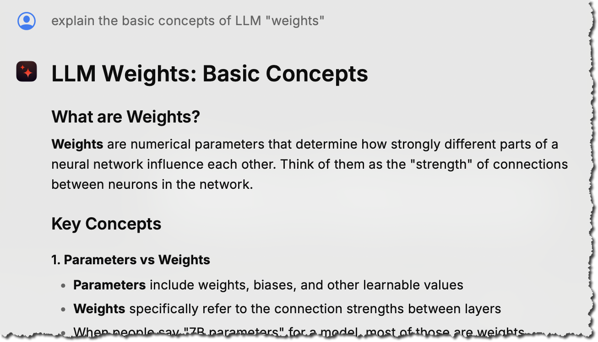

=== Rubberducking

image::images/2025-10-13T12-30-58-227Z.png[]

=== Clarity

image::images/2025-10-13T12-27-09-541Z.png[]

=== Reviews

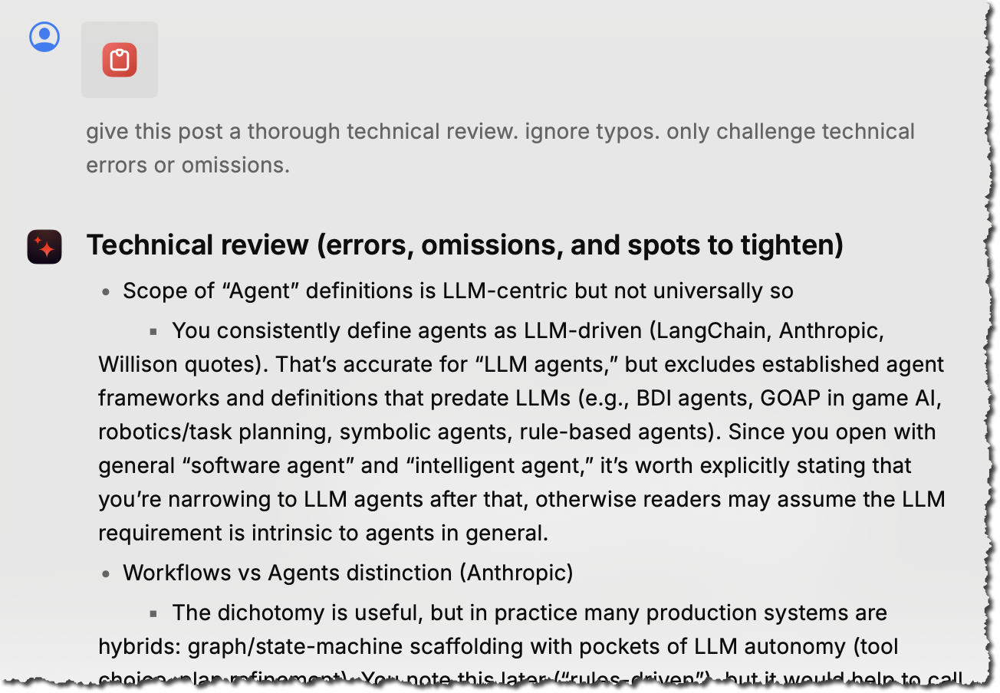

=== !
==== Prompt example

----
This is the draft of a blog article I am about to publish.
I would like you to concisely list the following:
- any typos. check what I give you five times to make sure
  you have caught everything.
- any factual errors or inconsistencies

Your primary responsibility is to catch typos and errors.
I write in en-gb.

Do not report on the use of `automagically`.
This is a good word.

Please also provide a very brief summary of the
readability of the article.
My voice is a technical yet informal one, aimed solely at
a developer audience. I use colloquialisms and snark.
----

=== Using AI to *write* posts?

== Ship It?

🛑 Not yet!

=== The importance of Reviews

* Before you send it anywhere…use a spell checker!
* Use GDoc in suggestion mode
* Be clear what you're asking for in the review
** Copyediting vs Technical review
** Respect the reviewer
** Don't be precious, but don't lose your voice

🔗 https://rmoff.net/2020/04/16/converting-from-asciidoc-to-google-docs-and-ms-word/[Converting from AsciiDoc to Google Docs and MS Word]

== Resources

* ✍️ https://rmoff.net/2023/07/19/blog-writing-for-developers/[Blog writing for Developers] - Robin Moffatt
* 🎥 https://www.youtube.com/watch?v=vtIzMaLkCaM[The Craft of Writing Effectively] - Larry McEnerney
* 🎧 https://oxide-and-friends.transistor.fm/episodes/technical-blogging[Oxide & Friends podcast]: Technical Blogging

[background-image="https://github.com/scynthiadunlop/WritingForDevelopersBook/raw/main/excerpts/cover_frame.png"]
== !

== !
* 📕 https://github.com/scynthiadunlop/WritingForDevelopersBook/[Writing For Developers: Blogs That Get Read] (Piotr Sarna & Cynthia Dunlop)
* 🔗 https://github.com/scynthiadunlop/WritingForDevelopersBook/blob/main/links/README.md[Resources] mentioned in the book

* 📰 https://writethatblog.substack.com/[Write that Blog!] (newsletter)

== #EOF (almost)

- Decide _why_ you're writing
- If you want to develop as a blog writer, find an author you like and ask them to mentor you
- Don't polish too much; no-one's going to read it anyway ;)
- Start, today!

== Q&A

_Now, or anytime - open invitation to DM me or get in touch on #devrel channel._

// 38 minutes
